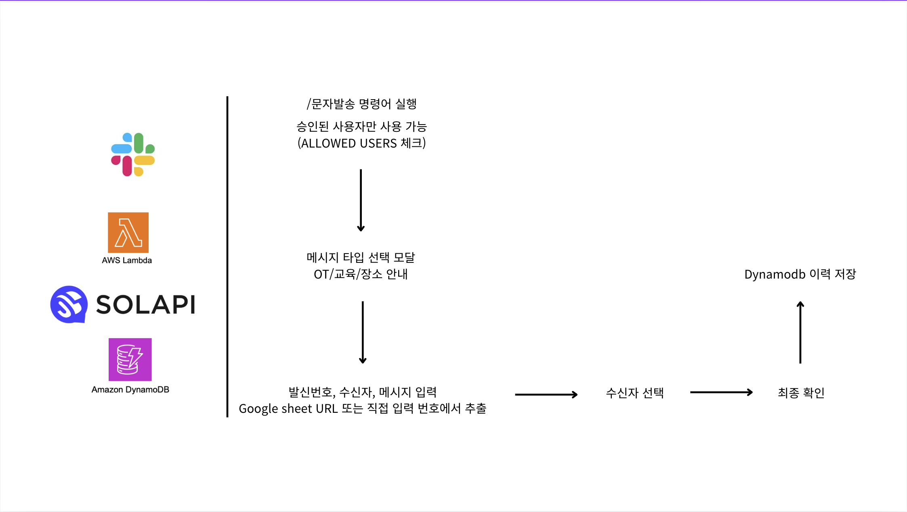

# Slack 문자 발송 봇

이 프로젝트는 Slack 워크스페이스에서 승인된 사용자가 모달을 통해 SMS 문자를 발송할 수 있는 시스템입니다. AWS Lambda, Slack Bolt, Solapi API, DynamoDB를 활용한 서버리스 아키텍처로 구현되어 있습니다.

## 시스템 아키텍처



아래와 같은 레이어로 구성됩니다:

- **엔드포인트 레이어**: Slack API (슬래시 명령어 및 모달 인터랙션)
- **애플리케이션 레이어**: AWS Lambda Function
- **외부 메시징 레이어**: Solapi SMS API
- **데이터베이스 레이어**: Amazon DynamoDB

## 기능

1. Slack 슬래시 명령어(`/문자발송`)로 문자 발송 모달 실행
2. 메시지 타입 선택 지원
   - OT 안내
   - 교육 안내
   - 장소/시간 안내
3. 타입별 기본 메시지 템플릿 제공
4. 발신번호 선택
5. Google Sheet URL에서 전화번호 자동 추출
6. 전화번호 직접 입력 지원
7. 추출된 수신자 목록 확인 및 일부 제외
8. 최종 발송 전 발신번호, 수신자, 메시지 확인
9. Solapi API를 통한 다건 SMS 발송
10. DynamoDB에 발송 기록 저장

## 설치 및 설정 가이드

### 1. AWS 리소스 설정

#### DynamoDB 테이블 생성

1. AWS 콘솔에서 DynamoDB 서비스로 이동
2. "테이블 생성" 선택
3. 테이블 이름: `sms-send-history` (또는 원하는 이름)
4. 파티션 키: `id` (문자열)
5. 기본 설정으로 테이블 생성

발송 기록에는 발송 일자, 시간, 메시지 제목, 메시지 타입, 전체/성공/실패 건수, 비용, 발송자 Slack User ID, 상태가 저장됩니다.

#### Lambda 함수 생성

하나의 Lambda 함수를 생성합니다:

1. **slack_message**: Slack 명령어, 모달 인터랙션, SMS 발송을 처리하는 함수

런타임: Python 3.9 이상 선택

#### Lambda 레이어 추가

Lambda 함수에 다음 Python 패키지가 필요합니다:

- `requests`
- `slack_bolt`
- `boto3`

`boto3`는 Lambda 런타임에 기본 포함되어 있지만, 런타임 또는 배포 방식에 따라 직접 패키징할 수 있습니다.

레이어로 구성하는 경우:

1. `requests`, `slack_bolt`가 포함된 Lambda Layer 생성
2. Lambda 함수의 "레이어" 섹션에서 "레이어 추가" 클릭
3. 생성한 레이어 선택 후 추가

ZIP 패키지로 배포하는 경우:

```bash
pip install requests slack_bolt -t package
cp slack_message.py config.py phone_numbers.py sms_service.py package/
cd package
zip -r ../slack_message.zip .
```

#### 환경 변수 설정

Lambda 함수에 다음 환경 변수를 설정합니다:

1. `BOT_TOKEN`: Slack Bot User OAuth Token
2. `SLACK_SIGNING_SECRET`: Slack 앱 Signing Secret
3. `SOLAPI_API_KEY`: Solapi API Key
4. `SOLAPI_API_SECRET`: Solapi API Secret
5. `SOLAPI_SENDER`: 기본 발신번호 (코드에서 선택된 발신번호가 없을 때 fallback)
6. `DYNAMODB_TABLE_NAME`: DynamoDB 테이블 이름 (기본값: `sms-send-history`)

#### IAM 권한 설정

Lambda 함수에 필요한 IAM 권한:

1. DynamoDB 쓰기 권한
2. CloudWatch Logs 권한

IAM 정책 예시:

```json
{
    "Version": "2012-10-17",
    "Statement": [
        {
            "Effect": "Allow",
            "Action": [
                "dynamodb:PutItem"
            ],
            "Resource": "arn:aws:dynamodb:*:*:table/sms-send-history"
        },
        {
            "Effect": "Allow",
            "Action": [
                "logs:CreateLogGroup",
                "logs:CreateLogStream",
                "logs:PutLogEvents"
            ],
            "Resource": "*"
        }
    ]
}
```

### 2. Slack 앱 설정

#### Slack 앱 생성

1. [Slack API 웹사이트](https://api.slack.com/apps)에서 "Create New App" 클릭
2. "From scratch" 선택
3. 앱 이름과 워크스페이스 선택 후 "Create App" 클릭

#### 봇 권한 설정

"OAuth & Permissions" 섹션에서 다음 Bot Token Scopes 추가:

- `commands` - 슬래시 명령어 사용
- `chat:write` - 채널 메시지 및 ephemeral 메시지 전송

#### 슬래시 명령어 설정

"Slash Commands" 섹션에서 새 명령어 추가:

1. "Create New Command" 클릭
2. Command: `/문자발송`
3. Request URL: Lambda Function URL
4. Short Description: "문자 발송 모달을 실행합니다"
5. "Save" 클릭

#### Interactivity 설정

"Interactivity & Shortcuts" 섹션에서:

1. "Interactivity" 활성화
2. Request URL: Lambda Function URL
3. "Save Changes" 클릭

이 봇은 Slack 모달의 `view_submission` 이벤트를 사용하므로 Interactivity Request URL 설정이 필요합니다.

#### 앱 설치 및 토큰 획득

1. "Install App" 섹션에서 "Install to Workspace" 클릭
2. 권한 요청 확인
3. 설치 후 "OAuth & Permissions" 섹션에서 "Bot User OAuth Token" 복사
4. 이 토큰을 Lambda 함수의 `BOT_TOKEN` 환경 변수에 설정
5. "Basic Information" 섹션에서 Signing Secret을 복사해 `SLACK_SIGNING_SECRET` 환경 변수에 설정

### 3. Solapi 설정

1. Solapi 콘솔에서 API Key와 API Secret 생성
2. SMS 발신번호 등록 및 승인
3. Lambda 환경 변수에 `SOLAPI_API_KEY`, `SOLAPI_API_SECRET`, `SOLAPI_SENDER` 설정
4. 코드의 `SENDER_NUMBERS` 목록을 실제 승인된 발신번호 목록으로 수정

현재 코드의 발신번호 목록은 `config.py`의 `SENDER_NUMBERS` 상수에서 관리합니다.

### 4. Lambda Function URL 설정

Slack에서 Lambda 함수를 직접 호출할 수 있도록 Function URL을 생성합니다:

1. AWS 콘솔에서 Lambda 서비스로 이동
2. `slack_message` 함수 선택
3. "구성" 탭에서 "함수 URL" 선택
4. "함수 URL 생성" 클릭
5. Auth type은 `NONE`으로 설정
6. 생성된 Function URL을 Slack 앱의 Slash Command 및 Interactivity Request URL에 사용

Slack 요청 검증은 `SLACK_SIGNING_SECRET`을 사용하는 Slack Bolt에서 처리합니다.

## 사용 방법

### 문자 발송

Slack 채널에서 다음 명령어를 입력합니다:

```text
/문자발송
```

명령어 실행 후 다음 순서로 진행합니다:

1. 메시지 타입 선택
2. 발신번호 선택
3. Google Sheet URL 입력 또는 전화번호 직접 입력
4. 메시지 내용 작성
5. 수신자 목록 확인 및 제외할 번호 해제
6. 최종 확인 후 발송

### Google Sheet 전화번호 입력

Google Sheet를 사용하는 경우:

1. 전화번호가 포함된 Google Sheet를 준비
2. 공유 설정을 "링크가 있는 모든 사용자"가 볼 수 있도록 변경
3. Slack 모달에 Sheet URL 입력

봇은 시트의 모든 셀에서 `01012345678` 또는 `010-1234-5678` 형식의 전화번호를 찾아 중복을 제거합니다.

### 직접 입력

직접 입력 칸에는 줄바꿈, 쉼표, 공백이 섞여 있어도 됩니다.

```text
01012345678
010-1234-5678
01098765432
```

### 권한 관리

사용 가능 사용자는 `config.py`의 `ALLOWED_USERS` 상수에서 Slack User ID로 관리합니다.

```python
ALLOWED_USERS = [
    "U05JLKA5FLG",
    "U06GSJW0B37"
]
```

새 사용자를 허용하려면 해당 사용자의 Slack User ID를 목록에 추가한 뒤 Lambda 함수를 다시 배포합니다.

## 코드 구조

### slack_message.py

Slack 명령어와 모달 인터랙션을 처리하는 Lambda 엔트리포인트입니다.

주요 처리 흐름:

1. `/문자발송` 명령어 수신
2. 메시지 타입 선택 모달 표시
3. 발신번호, 수신자 입력, 메시지 작성 모달 표시
4. Google Sheet 및 직접 입력에서 전화번호 추출
5. 수신자 선택 모달 표시
6. 최종 발송 확인 모달 표시
7. `sms_service.py`를 통해 Solapi API로 SMS 발송
8. `sms_service.py`를 통해 DynamoDB에 발송 기록 저장
9. Slack 채널에 발송 결과 메시지 전송

### config.py

허용 사용자, 발신번호, 메시지 템플릿, 환경 변수 이름, 한국 시간대 등 설정 값을 관리합니다.

### phone_numbers.py

Google Sheet CSV export와 직접 입력 텍스트에서 전화번호를 추출하고 중복을 제거합니다.

### sms_service.py

Solapi SMS 발송, DynamoDB 발송 이력 저장, 메시지 제목 추출을 담당합니다.

## 문제 해결

### 일반적인 문제

1. **Slack 모달이 열리지 않음**
   - `BOT_TOKEN`과 `SLACK_SIGNING_SECRET` 환경 변수가 올바른지 확인
   - Slack 앱에 `commands`, `chat:write` 권한이 있는지 확인
   - Slash Command Request URL이 Lambda Function URL과 일치하는지 확인

2. **모달 제출 후 응답이 없음**
   - Slack 앱의 Interactivity가 활성화되어 있는지 확인
   - Interactivity Request URL이 Lambda Function URL과 일치하는지 확인
   - Lambda CloudWatch Logs에서 Slack Bolt 오류 확인

3. **권한 없음 메시지가 표시됨**
   - 실행한 사용자의 Slack User ID가 `ALLOWED_USERS`에 포함되어 있는지 확인

4. **Google Sheet 접근 실패**
   - 시트 공유 설정이 "링크가 있는 모든 사용자"로 되어 있는지 확인
   - URL이 `https://docs.google.com/spreadsheets/d/...` 형식인지 확인
   - 시트에 `01012345678` 또는 `010-1234-5678` 형식의 번호가 있는지 확인

5. **Solapi 발송 실패**
   - `SOLAPI_API_KEY`, `SOLAPI_API_SECRET` 값 확인
   - Solapi에 등록 및 승인된 발신번호인지 확인
   - Solapi 잔액 및 API 응답의 `errorCode`, `errorMessage` 확인

6. **DynamoDB 기록 저장 실패**
   - `DYNAMODB_TABLE_NAME` 환경 변수와 실제 테이블 이름이 일치하는지 확인
   - Lambda IAM 역할에 `dynamodb:PutItem` 권한이 있는지 확인
   - 테이블 파티션 키가 `id` 문자열 타입인지 확인

7. **Lambda 함수 Timeout**
   - 수신자가 많거나 Google Sheet 응답이 느린 경우 타임아웃을 늘립니다.
   - Solapi API 호출은 최대 30초 timeout으로 설정되어 있습니다.

## 라이선스

이 프로젝트는 MIT 라이선스 하에 배포됩니다. 자세한 내용은 LICENSE 파일을 참조하세요.
